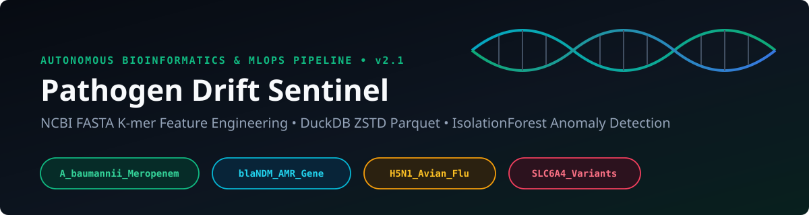
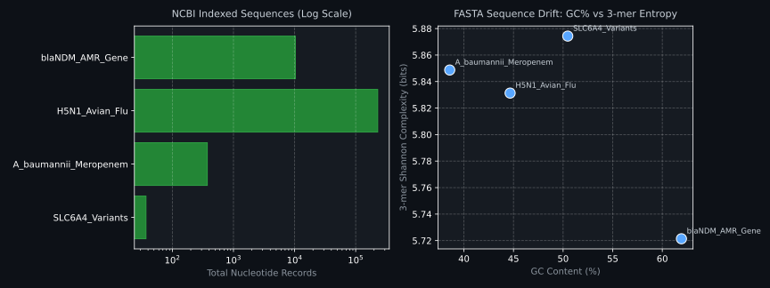
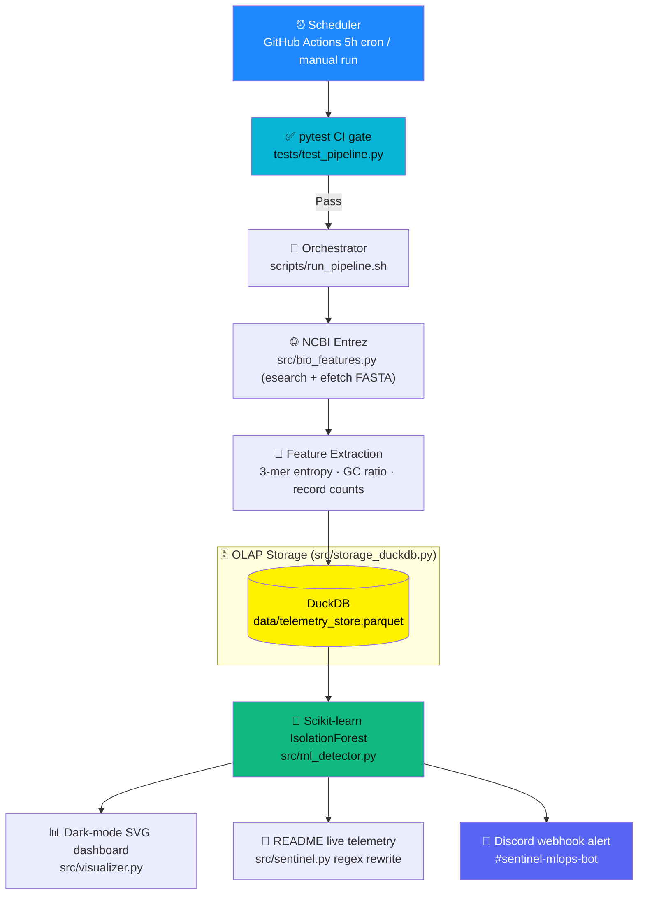

<div align="center">



# 🧬 Pathogen Drift Sentinel

### Genomic surveillance, engineered like a production ML system

*Ingest sequences. Extract features. Score anomalies. Alert. Repeat.*

[](https://github.com/AbdulRaffayQureshi/pathogen-drift-sentinel/actions/workflows/sentinel_cron.yml)


</div>

---

## 📖 Table of Contents

- [Overview](#-overview)
- [Live Telemetry](#-live-telemetry)
- [Dashboard](#-dashboard)
- [Surveillance Targets & Biological Significance](#-surveillance-targets--biological-significance)
- [System Architecture](#-system-architecture)
- [Version History: v1.0 vs v2.1](#-version-history-v10-vs-v21)
- [Feature Mathematics](#-feature-mathematics)
- [Repository Layout](#-repository-layout)
- [Quickstart (WSL + Zsh)](#-quickstart-wsl--zsh)
- [Quality Gate](#-quality-gate)
- [Roadmap](#-roadmap)
- [Author](#-author)

---

## 🧠 Overview

**Pathogen Drift Sentinel** watches four biologically meaningful targets for signs of change. It began as a lightweight NCBI record-count tracker and grew into a full MLOps pipeline that pulls real sequences, engineers genomic features, stores them in a columnar analytics database, and flags unusual runs with an unsupervised anomaly detector.

The guiding principle is the same one behind good drug-discovery pipelines: **a cheap early "no" beats an expensive late surprise.** If a target's sequence composition shifts, you want to know on the day it happens, with a number attached, not weeks later with a shrug.

| Capability | What it gives you |
|---|---|
| 🧪 **Sequence-level features** | 3-mer Shannon complexity profiles and GC ratio from raw FASTA |
| 🗄️ **Columnar storage** | DuckDB over ZSTD-compressed Parquet for fast OLAP queries on run history |
| 🤖 **Unsupervised detection** | Scikit-learn IsolationForest scores each run against its own history |
| 📊 **Self-updating visuals** | Dark-mode SVG dashboard and a README telemetry block rewritten every 5 hours |
| ✅ **Production hygiene** | A pytest CI gate that must pass before anything ships |

---

## 📡 Live Telemetry

The block below is rewritten automatically by the pipeline on every run. Do not edit it by hand.

<!-- TELEMETRY_START -->
* 🕒 **Last Automated Sync (UTC):** `2026-10-08 21:23:21 UTC`
* 🗄️ **Cumulative DuckDB Parquet Snapshots:** `104`
* 🧬 **Macro Distribution Entropy ($H$):** `0.2750 bits`
* 🧠 **Isolation Forest Anomaly Engine:** `NOMINAL` *(Min Decision Score: `0.0800`)*

| 🎯 Surveillance Target | 🧬 NCBI Records | ⚡ 5h Velocity ($\Delta$) | 🧪 FASTA GC% | 🔢 3-mer Complexity ($H_3$) | 🛡️ Isolation Forest State |
| :--- | :---: | :---: | :---: | :---: | :---: |
| `H5N1_Avian_Flu` | **229,339** | `+0` | `44.66%` | `5.8313 bits` | 🟢 NORMAL (`0.080`) |
| `SLC6A4_Variants` | **37** | `+0` | `50.47%` | `5.8743 bits` | 🟢 NORMAL (`0.316`) |
| `blaNDM_AMR_Gene` | **10,339** | `+0` | `61.93%` | `5.7214 bits` | 🟢 NORMAL (`0.316`) |
| `A_baumannii_Meropenem` | **373** | `+0` | `38.57%` | `5.8487 bits` | 🟢 NORMAL (`0.316`) |
<!-- TELEMETRY_END -->

---

## 🖥️ Dashboard

<div align="center">



</div>

The dashboard is a dark-mode SVG regenerated on every run (`assets/telemetry_dashboard.svg`), so it renders natively on GitHub with no JavaScript and no hosted service.

---

## 🎯 Surveillance Targets & Biological Significance

Each target was chosen because drift in it has a concrete clinical or public-health meaning, and because together they cover bacteria, a resistance gene, a virus, and a human gene.

<details open>
<summary><b>🦠 A_baumannii_Meropenem — carbapenem-resistant <i>Acinetobacter baumannii</i></b></summary>

<br>

*Acinetobacter baumannii* is a Gram-negative opportunist that thrives in hospitals, especially intensive care units, where it causes ventilator-associated pneumonia, bloodstream infections and wound infections. It belongs to the ESKAPE group of pathogens and carbapenem-resistant strains sit in the WHO's critical priority tier for new antibiotics.

**Why meropenem?** Meropenem is a carbapenem, a last-line antibiotic. Resistance in this species typically arises through carbapenem-hydrolysing OXA-type enzymes, efflux pumps and porin loss, often reinforced by mobile genetic elements. Tracking how this target's sequence landscape moves over time is a proxy for how fast resistant lineages are being deposited and diversifying.

</details>

<details>
<summary><b>🧫 blaNDM_AMR_Gene — New Delhi metallo-β-lactamase</b></summary>

<br>

*bla*NDM encodes a zinc-dependent class B β-lactamase that hydrolyses almost every β-lactam antibiotic, including carbapenems. Aztreonam is the notable exception, though co-resistance mechanisms often neutralise it anyway.

**Why it matters:** the gene travels on plasmids, so it jumps between species and genera, mostly among Enterobacterales such as *Klebsiella pneumoniae* and *Escherichia coli*. First characterised in 2008, it is now reported worldwide, with particular burden across South Asia. A gene that spreads horizontally is exactly the kind of target where composition drift can reveal new variants and new host backgrounds.

</details>

<details>
<summary><b>🦆 H5N1_Avian_Flu — highly pathogenic avian influenza A(H5N1)</b></summary>

<br>

H5N1 is an influenza A virus with a segmented RNA genome, which gives it two routes to change: gradual point mutation (antigenic drift) and reassortment of segments when two viruses co-infect a host. Clade 2.3.4.4b has spread across wild birds and poultry on multiple continents and has caused infections in mammals.

**What to watch:** mutations in the haemagglutinin gene that affect receptor binding, and changes at its cleavage site, are central to whether a bird virus gains a foothold in mammals. Sequence composition drift across newly deposited records is an early, cheap signal that the circulating population is shifting.

</details>

<details>
<summary><b>🧠 SLC6A4_Variants — serotonin transporter gene</b></summary>

<br>

*SLC6A4* encodes the serotonin transporter, which clears serotonin from the synapse and is the molecular target of SSRI antidepressants. The gene sits on chromosome 17 and is best known for the 5-HTTLPR length polymorphism in its promoter region.

**Why include a human gene in a pathogen sentinel?** It acts as a **biological control**. Human germline genes should drift far less than rapidly evolving pathogens, so this target helps calibrate what "quiet" looks like and keeps the anomaly detector honest. Associations between 5-HTTLPR and mood or anxiety traits have replicated inconsistently, so this target is used here for pharmacogenomic and calibration relevance, not as a disease predictor.

</details>

---

## 🏗️ System Architecture



**Core loop:** *test → fetch → featurize → persist → score → publish.* Every stage is modularized inside `src/`, so each component can be unit-tested in isolation and swapped without touching the others.

---

## 🔄 Version History: v1.0 vs v2.1

| Dimension | v1.0 | v2.1 |
|---|---|---|
| **Signal** | NCBI record counts | Raw FASTA sequences + record velocity |
| **Features** | Macro Shannon entropy | 3-mer Shannon complexity ($H_3$), GC ratio, SQL $\Delta$ velocity |
| **Storage** | Flat JSON (`telemetry_history.json`) | DuckDB over ZSTD Parquet (`data/telemetry_store.parquet`) |
| **Detection** | Static threshold | Scikit-learn `IsolationForest`, unsupervised |
| **Output** | Discord webhook | Discord webhook + SVG dashboard + README telemetry |
| **Quality gate** | None | `pytest` CI gate (`tests/test_pipeline.py`) |

<details>
<summary><b>📦 v1.0 — Count tracking, macro entropy, Discord alerts</b></summary>

<br>

The first version asked a simple question: *is the amount of public data on each target changing?*

- **NCBI count tracking:** query record counts per target on each run and compare them with the previous snapshot.
- **Macro Shannon entropy:** summarise how evenly total indexed records are distributed across the four targets.
- **Discord webhook:** push a compact report to `#sentinel-mlops-bot` so the signal reaches a human immediately.

**Where it hit a ceiling:** counts say *how much* is being deposited, never *what changed inside the sequences*. A burst of submissions and a genuine mutation wave look identical to a count tracker. That limitation motivated v2.1.

</details>

<details>
<summary><b>🚀 v2.1 — Sequence features, OLAP history, ML scoring, CI gate</b></summary>

<br>

v2.1 moves from counting records to reading them.

1. **FASTA k-mer extraction (`src/bio_features.py`).** Sequences are decomposed into overlapping 3-mers and converted to Shannon complexity ($H_3$ bits).
2. **GC ratio (`src/bio_features.py`).** The share of G and C bases per sequence set is a fast compositional fingerprint that shifts with lineage and host adaptation.
3. **DuckDB with ZSTD Parquet (`src/storage_duckdb.py`).** Every run is appended to `data/telemetry_store.parquet` with SQL `LAG()` windowing to track 5-hour velocity.
4. **Scikit-learn IsolationForest (`src/ml_detector.py`).** An unsupervised model scores each run against the target's own history across `[delta_records, gc_pct, kmer_entropy]`.
5. **Dark-mode SVG dashboard (`src/visualizer.py`).** Renders `assets/telemetry_dashboard.svg` directly into the README.
6. **pytest CI gate (`tests/test_pipeline.py`).** Feature maths and ML regime transitions are verified before any run executes.

</details>

---

## 📐 Feature Mathematics

**Shannon entropy** measures how evenly a distribution is spread. With $p_i$ as the fraction of the total contributed by category $i$:

$$H = -\sum_{i=1}^{n} p_i \log_2 p_i$$

**k-mer frequency** for a 3-mer $w$ in a sequence of length $L$, where $c(w)$ is its observed count:

$$f(w) = \frac{c(w)}{L - k + 1}$$

**GC ratio** and its percentage-style form, written without any comment-sensitive characters:

$$\text{GC}_{\text{ratio}} = \frac{G + C}{A + T + G + C}, \qquad \text{GC}_{\text{pct}} = 100 \times \text{GC}_{\text{ratio}}$$

**IsolationForest anomaly score** for a sample $x$ among $n$ samples, where $E[h(x)]$ is its mean path length across trees and $c(n)$ is the average path length of an unsuccessful search:

$$s(x, n) = 2^{-\frac{E[h(x)]}{c(n)}}$$

---

## 📂 Repository Layout

```text
pathogen-drift-sentinel/
│
├── src/
│   ├── sentinel.py            # 🧠 Master coordinator + README marker injection
│   ├── bio_features.py        # 🧬 NCBI Entrez esearch/efetch + FASTA GC & 3-mer math
│   ├── storage_duckdb.py      # 🗄️ DuckDB OLAP windowing + ZSTD Parquet persistence
│   ├── ml_detector.py         # 🤖 Scikit-learn IsolationForest anomaly scoring
│   └── visualizer.py          # 📊 Dark-mode Matplotlib SVG dashboard renderer
│
├── scripts/
│   └── run_pipeline.sh        # 🐚 Shell orchestrator + Discord rich embed dispatcher
│
├── tests/
│   └── test_pipeline.py       # ✅ pytest unit test suite enforced by the CI gate
│
├── data/
│   └── telemetry_store.parquet # 🗄️ ZSTD-compressed columnar time-series store
│
├── assets/
│   ├── banner.svg             # 🎨 Project header banner
│   └── telemetry_dashboard.svg # 📊 Auto-generated dark-mode telemetry plots
│
├── .github/
│   └── workflows/
│       └── sentinel_cron.yml  # ⚙️ 5-hour cron schedule + pytest gate + auto-commit
│
├── requirements.txt
└── README.md
```

---

## 🚀 Quickstart (WSL + Zsh)

### 1. Clone and enter the project
```zsh
git clone https://github.com/AbdulRaffayQureshi/pathogen-drift-sentinel.git
cd pathogen-drift-sentinel
```

### 2. Create an isolated environment
```zsh
python3 -m venv .venv
source .venv/bin/activate
pip install --upgrade pip
pip install -r requirements.txt
```

### 3. Configure local Discord secret
```zsh
echo 'DISCORD_WEBHOOK_URL="https://discord.com/api/webhooks/YOUR_ID/YOUR_TOKEN"' > .env
```

### 4. Run the quality gate and execute the pipeline
```zsh
pytest tests/test_pipeline.py -v
./scripts/run_pipeline.sh
```

<details>
<summary><b>🐚 Zsh tips for this project</b></summary>

<br>

- Quote any glob you pass to a tool, for example `'data/*.parquet'`, because Zsh errors out on an unmatched wildcard instead of passing it through.
- Keep the project inside the native WSL Linux filesystem (`~/pathogen-drift-sentinel`), not under `/mnt/c`, for fast DuckDB and Git I/O.

</details>

---

## ✅ Quality Gate

The CI gate treats the pipeline like production software:

- Unit tests in `tests/test_pipeline.py` cover GC content, 3-mer Shannon entropy, and `IsolationForest` warmup-to-active transitions.
- Nothing runs or commits in `.github/workflows/sentinel_cron.yml` unless `pytest` passes first.

---

## 🗺️ Roadmap

- [ ] Add more surveillance targets through YAML configuration
- [ ] Track mutation drift against a fixed RefSeq reference accession
- [ ] Add per-target historical sparklines to `assets/telemetry_dashboard.svg`
- [ ] Deploy an interactive Streamlit exploration frontend over `data/telemetry_store.parquet`

---

## 👤 Author

**Abdul Raffay Qureshi** — BS Bioinformatics • Machine Learning • Full-Stack Engineering
Building modern machine learning & MLOps automation inside bioinformatics workflows.

[](https://github.com/AbdulRaffayQureshi)

<div align="center">

*Fail on a computer, not in a clinic.*

</div>
