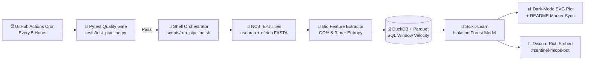

# 🧬 Pathogen & Genomic Drift Sentinel (v2.1 MLOps)

**Autonomous Bioinformatics Surveillance, Sequence Feature Engineering, DuckDB/Parquet OLAP Storage & Unsupervised Anomaly Detection Pipeline**

---

## 🎯 Executive Overview & Purpose
**Pathogen & Genomic Drift Sentinel** is an end-to-end Linux/Zsh MLOps and computational biology pipeline that executes autonomously every **5 hours** via GitHub Actions. It monitors global sequence repositories (**NCBI Entrez / Nuccore**) across critical antimicrobial resistance (AMR) genes, zoonotic pathogens, and clinical human loci, extracting molecular sequence features and flagging statistical submission or compositional drift in real time.

---

<!-- TELEMETRY_START -->
<!-- TELEMETRY_END -->

---

## 🏗️️ System Architecture & Data Workflow

---

## 🔍 Interactive Feature & Module Reference

<b>1. 🧬 Evolution from v1.0 (Baseline) to v2.1 (Enterprise MLOps)</b> <i>(Click to collapse/expand)</i>

| Capability Layer | v1.0 Baseline Architecture | v2.1 Enterprise MLOps Architecture |
| :--- | :--- | :--- |
| **Data Ingestion** | NCBI `esearch` total record counts only | NCBI `esearch` counts + `efetch` live **FASTA nucleotide sequences** |
| **Feature Engineering** | Macro count Shannon entropy ($) | **FASTA GC-Content (%)**, **3-mer Shannon sequence complexity ($)**, & SQL 5h velocity ($\Delta$) |
| **Storage Engine** | Flat JSON array (`telemetry_history.json`) | Columnar **DuckDB + ZSTD Apache Parquet** (`telemetry_store.parquet`) with `LAG()` windowing |
| **Machine Learning** | None (Static threshold) | Unsupervised **Scikit-Learn `IsolationForest`** multidimensional outlier scoring |
| **Observability & Testing** | Basic Discord text embed | **`pytest` CI gate**, **Dark-mode Matplotlib SVG dashboard**, & **Multi-tier Discord embeds** |

<b>2. 📐 Mathematical & Bioinformatic Formulations</b> <i>(Click to expand)</i>

* **3-mer Nucleotide Shannon Complexity ($):** Quantifies sequence randomness and compositional drift across sliding 3-base windows (=3$, ^3 = 64$ possible codons):
  132956H_3 = -\sum_{i=1}^{64} p(k_i) \log_2 p(k_i)132956
* **GC-Content Percentage (\%$):** Tracks evolutionary and structural stability across latest submitted isolates:
  132956GC\% = \left( \frac{G + C}{A + T + G + C} \right) \times 100132956
* **Isolation Forest Decision Score:** Partitions the feature matrix  = [\Delta_{\text{records}}, GC\%, H_3]$ using randomized binary trees (, ). Shorter average path lengths (h(x))$ isolate anomalous submission spikes or sudden sequence mutations.

<b>3. 📂 Repository Directory & File Interconnections</b> <i>(Click to expand)</i>

* `src/bio_features.py` — Queries NCBI Entrez `esearch.fcgi` and `efetch.fcgi`, parses raw FASTA strings, and calculates \%$ and $.
* `src/storage_duckdb.py` — Executes in-memory DuckDB OLAP queries over `data/telemetry_store.parquet` using SQL window functions (`LAG`, `AVG OVER`).
* `src/ml_detector.py` — Runs Scikit-Learn `IsolationForest` and classifies each target into `WARMUP`, `NORMAL`, or `ANOMALY`.
* `src/visualizer.py` — Renders the dual-panel dark-mode vector dashboard to `assets/telemetry_dashboard.svg`.
* `src/sentinel.py` — Master coordinator that orchestrates all modules and surgically injects live metrics between `<!-- TELEMETRY_START -->` and `<!-- TELEMETRY_END -->`.
* `scripts/run_pipeline.sh` — Bash wrapper that captures latency/exit codes and dispatches color-coded telemetry cards to Discord.
* `tests/test_pipeline.py` — Automated `pytest` suite verifying sequence math and ML state transitions before every cloud run.

---

  <i>Maintained & Architected by <b>Abdul Raffay Qureshi</b> • Automated via WSL Zsh & GitHub Actions</i>

